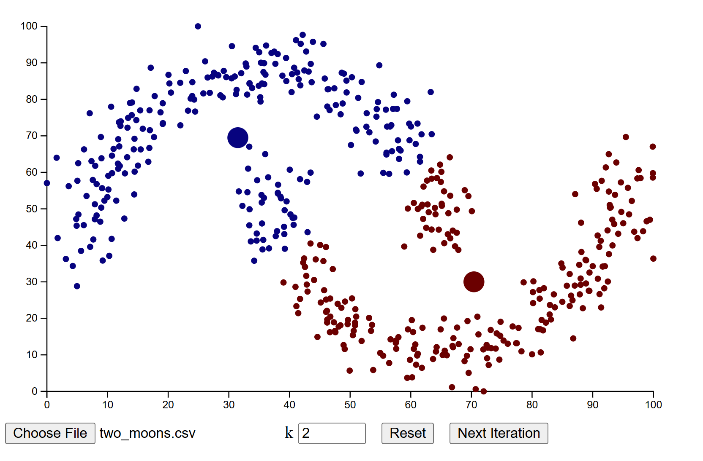

# k-means clustering in your browser

**K-means** is an unsupervised machine learning algorithm used to partition a dataset into a set of distinct, non-overlapping groups called *clusters*. It works by initializing a set of centroids, assigning data points to the nearest centroid, and iteratively updating the centroids based on the mean of the assigned points until convergence.

This project visualizes the k-means clustering process directly in your browser.



## Dataset input

The application accepts a dataset in `.csv` format, which contains two columns of numerical values representing 2D data points.

An example dataset is provided in the repository under the `examples/` directory.

To upload your own dataset, use the Choose File button in the app interface and select a .csv file from your local machine.

## How to run

1. Clone the repository
```bash
git clone git@github.com:rovazh/visual-kmeans.git
```

2. Install dependencies
```bash
npm install
```
3. Start the project
```bash
npm run start
```
